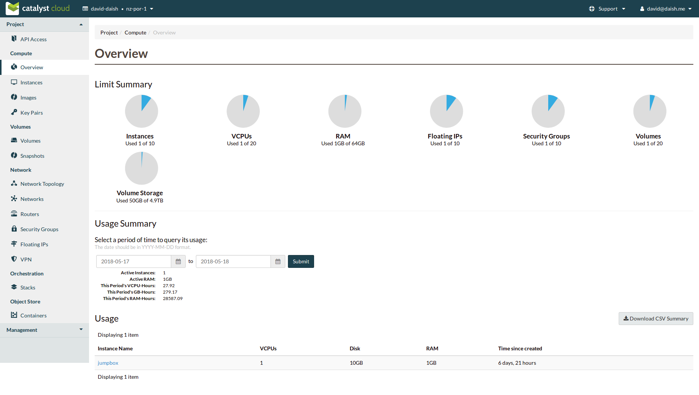

.. _access_to_catalyst_cloud:

############################
Accessing the Catalyst Cloud
############################

In the previous section, we learned about the various services the Catalyst
Cloud offers. Now we'll learn about the various ways users can access services.

*****************
The web dashboard
*****************

The web dashboard is a simple way to interact with The Catalyst Cloud. It can
be found at https://dashboard.cloud.catalyst.net.nz.

One advantage to the web dashboard is that it is accessable from any IP address,
making it a quick way to perform tasks on the Catalyst Cloud while you're away
from your normal work station.

**************************
The command line interface
**************************

The command line interface (CLI) is a very powerful, efficent way to interact
with Catalyst Cloud. To interact with Catalyst Cloud through the CLI, a user
must:

1) Install the OpenStack CLI.
2) Tell the OpenStack CLI who you are, and which OpenStack cloud you want to
   talk to. This is done with an OpenStack enviroment file (RC file).

We have written a best practice guide to help you do this :ref:`here
<command-line-interface>`. We're also working on an experemental command line
client designed to help you get up on the command line as quickly and
intuitively as possible. You can `try it here
<https://github.com/catalyst-cloud/openstackclient-container>`_.

After installing and configuring the CLI, you may want to familiarise yourself
with it's functioning by following :ref:`this tutorial
<using-the-command-line-interface>` to use it to deploy a compute instance.

For more indepth documentation, the offical OpenStack documentation is the most
thorough source of information. You can `find it here
<https://docs.openstack.org/python-openstackclient>`_.
