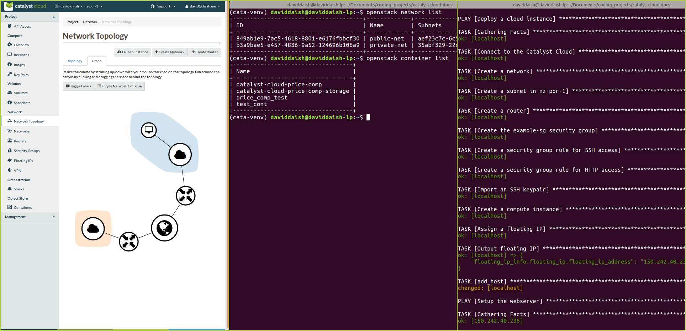

############################
The basics of Catalyst Cloud
############################

Welcome to the Catalyst Cloud documentation! This documentation is for those
who know almost nothing about Catalyst Cloud, and maybe don't know anything
about cloud computing in general.

***************************
What is the Catalyst Cloud?
***************************

Catalyst Cloud is a cloud computing platform, based entirely in New Zealand.

Catalyst Cloud was built with the open source project, OpenStack. OpenStack is a
piece of software that allows users like yourself to rent servers. You can
rent things like storage space, compute capacity, or internet access. Everything
you need to run a business's applications.

The genius of OpenStack is that it allows you to rent exactly what you need. No
more, no less. It also allows you to change how much you're renting quickly,
easily, and automatically, through a variety of tools.

